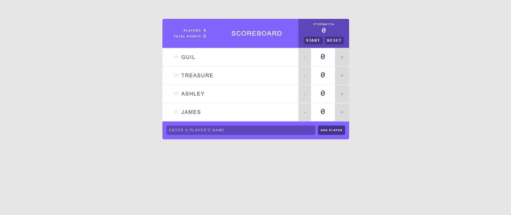

# Scoreboard

A scoreboard tracker made with React, with functionality that resembles a real scoreboard from a video game or similar. 
  
 

## Built With
- JavaScript
- React.Js

## Live Demo

[Live Demo Link](https://ceci007.github.io/scoreboard)

## Author
- Cecilia Benitez
- 👤GitHub: https://github.com/Ceci007

## Show your support
Give a ⭐️ if you like this project!

## Acknowledgments
- Inspiration
Appreciate Mosh Hamedani for his blog tutorial, who help me to create this project.
